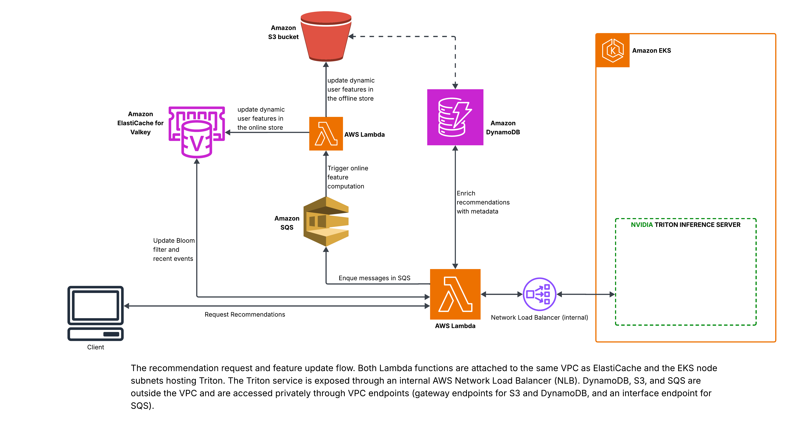

# Summary
This documentation presents how to set up the DynamoDB table for enriching recommendations with item metadata, as well as the Lambda functions for fetching recommendations and updating behavioral features in the feature stores.



## 1.  Download the Original Items Metadata and Images
* Please visit this link to download the items metadata and the images with UUIDs: 
[GOOGLE DRIVE LINK](https://drive.google.com/file/d/1J5caMIMkDIq5pAI1LeMu6KgE8PLJS0gs/view?usp=sharing)
* Unzip and Place the unzipped folder here.

## 1. Setting the dynamoDB table for item metadata lookup
* Make the script executable
```bash
chmod +x set_up_dynamodb.sh
```

* Set the env vars:
```bash
export ITEMS_TABLE_NAME="items" #your DynamoDB table will be named this
export REGION="us-east-1"
export S3_BUCKET="item-images-with-uuid-bucket" #replace. the bucket will be created by this script
```

* Run the script
```bash
./set_up_dynamodb.sh $ITEMS_TABLE_NAME $REGION $S3_BUCKET
```

* Confirm image uploads and DynamoDB entries
```bash
aws s3 ls s3://$S3_BUCKET/items/ --recursive | wc -l
aws dynamodb scan --table-name $ITEMS_TABLE_NAME --region $REGION --select COUNT --query 'Count'
aws dynamodb get-item --table-name $ITEMS_TABLE_NAME --region $REGION \
  --key '{"item_id": {"N": "0"}}'
```

## 2. Setting up the `recsys-recommend` Lambda function
This function is responsible for fetching recommendations, updating the Bloom filter, and enqueueing messages to the SQS queue to trigger online feature computation. Because the Triton Inference Service is exposed through an internal AWS Network Load Balancer (NLB), the Lambda function is deployed into the same VPC same VPC as ElastiCache and the EKS node subnets hosting Triton, so it can privately reach Redis and the Triton service.

* Build and push the container image to ECR
```bash
export AWS_ACCOUNT_ID="$(aws sts get-caller-identity --query Account --output text)"
chmod +x push_lambda_image.sh  
./push_lambda_image.sh $REGION $AWS_ACCOUNT_ID
```

* Find your VPC config
```bash
SECURITY_GROUP=$(aws elasticache describe-cache-clusters --show-cache-node-info \
  --query 'CacheClusters[0].SecurityGroups[0].SecurityGroupId' --output text)
```

* Fetch the subnets
```bash
SUBNET_GROUP=$(aws elasticache describe-cache-clusters --show-cache-node-info \
  --query 'CacheClusters[0].CacheSubnetGroupName' --output text)

SUBNETS=$(aws elasticache describe-cache-subnet-groups \
  --cache-subnet-group-name $SUBNET_GROUP \
  --query 'CacheSubnetGroups[0].Subnets[].SubnetIdentifier' \
  --output text | tr '\t' ',')

echo "$SUBNETS"
```
* Fetch the ElastiCache primary endpoint (for REDIS_HOST)
```bash
REDIS_HOST=$(aws elasticache describe-replication-groups \
  --query 'ReplicationGroups[0].NodeGroups[0].PrimaryEndpoint.Address' \
  --output text)
```

* Fetch the Triton service NLB endpoint
```bash
TRITON_HOST="$(kubectl get svc triton-triton-inference-server -n kubeflow \
  -o jsonpath='{.status.loadBalancer.ingress[0].hostname}'):8001"
echo "$TRITON_HOST"
```

* Create the IAM role
```bash
aws iam create-role --role-name recsys-lambda-role \
  --assume-role-policy-document '{"Version":"2012-10-17","Statement":[{"Effect":"Allow","Principal":{"Service":"lambda.amazonaws.com"},"Action":"sts:AssumeRole"}]}'

aws iam attach-role-policy --role-name recsys-lambda-role \
  --policy-arn arn:aws:iam::aws:policy/service-role/AWSLambdaVPCAccessExecutionRole

aws iam attach-role-policy --role-name recsys-lambda-role \
  --policy-arn arn:aws:iam::aws:policy/AmazonDynamoDBReadOnlyAccess
```

* Create the function:  
```bash
aws lambda create-function \
  --function-name recsys-recommend \
  --package-type Image \
  --code ImageUri=$AWS_ACCOUNT_ID.dkr.ecr.$REGION.amazonaws.com/recsys-lambda:latest \
  --role arn:aws:iam::$AWS_ACCOUNT_ID:role/recsys-lambda-role \
  --timeout 30 --memory-size 512 \
  --vpc-config "SubnetIds=$SUBNETS,SecurityGroupIds=$SECURITY_GROUP" \
  --environment "Variables={TRITON_HOST=$TRITON_HOST,REDIS_HOST=$REDIS_HOST,DYNAMO_TABLE=$ITEMS_TABLE_NAME}" \
  --region $REGION
```

### Networking — allow Lambda to reach Triton and DynamoDB

Lambda runs in the ElastiCache VPC (private subnets). Three things are needed:

**a. Allow Lambda SG → EKS cluster SG on port 8001 (Triton gRPC)**
```bash
EKS_SG=$(aws eks describe-cluster --name $CLUSTER \
  --query 'cluster.resourcesVpcConfig.clusterSecurityGroupId' --output text)

aws ec2 authorize-security-group-ingress \
  --group-id $EKS_SG \
  --protocol tcp --port 8001 \
  --source-group $SECURITY_GROUP \
  --region $REGION
```

**b. Allow Lambda SG → EKS cluster SG on the Triton NodePort**

The internal NLB routes through NodePorts. Find and open it:
```bash
NODE_PORT=$(kubectl get svc triton-triton-inference-server -n kubeflow \
  -o jsonpath='{.spec.ports[?(@.port==8001)].nodePort}')
echo "NodePort: $NODE_PORT"

aws ec2 authorize-security-group-ingress \
  --group-id $EKS_SG \
  --protocol tcp --port $NODE_PORT \
  --source-group $SECURITY_GROUP \
  --region $REGION
```

**c. Add DynamoDB and S3 VPC Gateway Endpoints (free)**

Lambda in a private VPC cannot reach DynamoDB or S3 without these. S3 is required by the feature-computation Lambda to load the Feast registry.
```bash
VPC_ID=$(aws ec2 describe-subnets --subnet-ids $(echo $SUBNETS | tr ',' ' ') \
  --query 'Subnets[0].VpcId' --output text)

ROUTE_TABLE_IDS=$(aws ec2 describe-route-tables \
  --filters "Name=vpc-id,Values=$VPC_ID" \
  --query 'RouteTables[].RouteTableId' \
  --output text | tr '\t' ' ')

aws ec2 create-vpc-endpoint \
  --vpc-id $VPC_ID \
  --service-name com.amazonaws.$REGION.dynamodb \
  --route-table-ids $ROUTE_TABLE_IDS \
  --region $REGION

aws ec2 create-vpc-endpoint \
  --vpc-id $VPC_ID \
  --service-name com.amazonaws.$REGION.s3 \
  --route-table-ids $ROUTE_TABLE_IDS \
  --region $REGION
```

**4. Add an SQS VPC Interface Endpoint**

Lambda in a private VPC cannot reach SQS without this — `mark_seen` will hang and timeout at 30s.
Interface endpoints require one subnet per AZ, so pass only the first subnet:
```bash
FIRST_SUBNET=$(echo $SUBNETS | tr ',' ' ' | awk '{print $1}')

aws ec2 create-vpc-endpoint \
  --vpc-id $VPC_ID \
  --vpc-endpoint-type Interface \
  --service-name com.amazonaws.$REGION.sqs \
  --subnet-ids $FIRST_SUBNET \
  --security-group-ids $SECURITY_GROUP \
  --private-dns-enabled \
  --region $REGION
```

Allow inbound HTTPS from Lambda to the SQS endpoint (both share the same security group):
```bash
aws ec2 authorize-security-group-ingress \
  --group-id $SECURITY_GROUP \
  --protocol tcp \
  --port 443 \
  --source-group $SECURITY_GROUP \
  --region $REGION
```

* Set up the function url access and auth
```bash
aws lambda add-permission \
  --function-name recsys-recommend \
  --statement-id FunctionURLAllowPublicAccess \
  --action lambda:InvokeFunctionUrl \
  --principal "*" \
  --function-url-auth-type NONE \
  --region $REGION
```

* create the function url
```bash
aws lambda create-function-url-config \
  --function-name recsys-recommend \
  --auth-type NONE \
  --region $REGION
```

* test the url
```bash
curl -s -X POST $LAMBDA_URL \
  -H "Content-Type: application/json" \
  -d '{"user_id": 1008, "device_type": 1}' | jq .
```

## 2. Setting up the SQS queue for behavioral feature computation
The `recsys-recommend` lambda enques messages to SQS to trigger the online feature computation lambda.

* Create the queue (VisibilityTimeout must be ≥ Lambda timeout of 60s)
```bash
QUEUE_URL=$(aws sqs create-queue \
  --queue-name recsys-feature-computation \
  --region $REGION \
  --attributes VisibilityTimeout=60 \
  --query 'QueueUrl' --output text)

QUEUE_ARN=$(aws sqs get-queue-attributes \
  --queue-url $QUEUE_URL \
  --attribute-names QueueArn \
  --query 'Attributes.QueueArn' --output text)

echo "QUEUE_URL=$QUEUE_URL"
echo "QUEUE_ARN=$QUEUE_ARN"
```

* Add `sqs:SendMessage` to the serving Lambda role
```bash
aws iam attach-role-policy --role-name recsys-lambda-role \
  --policy-arn arn:aws:iam::aws:policy/AmazonSQSFullAccess
```

* Update the existing `recsys-recommend` Lambda to include `SQS_QUEUE_URL`
```bash
aws lambda update-function-configuration \
  --function-name recsys-recommend \
  --environment "Variables={TRITON_HOST=$TRITON_HOST,REDIS_HOST=$REDIS_HOST,DYNAMO_TABLE=$ITEMS_TABLE_NAME,SQS_QUEUE_URL=$QUEUE_URL}" \
  --region $REGION
```

## 3. Setting up the feature computation Lambda
This function is triggered by SQS when a message arrives in the queue. It computes the current user's `top_category` based on events from the past 24 hours in the user's sorted set, then updates both the online and offline feature stores with the new `top_category`. This ensures the model can use the most recent user features on the next request. Although online feature updates are often processed asynchronously in batches, this setup updates features immediately for each queued event to demonstrate near real-time adaptation of the models to recent user behavior.

* Build and push the container image
```bash
chmod +x push_feature_computation_image.sh
./push_feature_computation_image.sh $REGION $AWS_ACCOUNT_ID
```

* Create an IAM role for the feature computation Lambda.
```bash
aws iam create-role --role-name recsys-feature-lambda-role \
  --assume-role-policy-document '{"Version":"2012-10-17","Statement":[{"Effect":"Allow","Principal":{"Service":"lambda.amazonaws.com"},"Action":"sts:AssumeRole"}]}'

aws iam attach-role-policy --role-name recsys-feature-lambda-role \
  --policy-arn arn:aws:iam::aws:policy/service-role/AWSLambdaVPCAccessExecutionRole

aws iam attach-role-policy --role-name recsys-feature-lambda-role \
  --policy-arn arn:aws:iam::aws:policy/AmazonDynamoDBReadOnlyAccess

aws iam attach-role-policy --role-name recsys-feature-lambda-role \
  --policy-arn arn:aws:iam::aws:policy/AmazonSQSFullAccess

aws iam attach-role-policy --role-name recsys-feature-lambda-role \
  --policy-arn arn:aws:iam::aws:policy/AmazonS3ReadOnlyAccess
```

* Allow the Lambda to write behavioral feature updates to the S3 offline store.  
This closes the training/serving skew loop — see `feature_computation.py`.
```bash
aws iam put-role-policy --role-name recsys-feature-lambda-role \
  --policy-name BehavioralUpdatesWrite \
  --policy-document '{
    "Version": "2012-10-17",
    "Statement": [{
      "Effect": "Allow",
      "Action": "s3:PutObject",
      "Resource": "arn:aws:s3:::'"$FEAST_S3_BUCKET"'/feast/behavioral_updates/*"
    }]
  }'
```

* Create the function (same VPC as ElastiCache so it can reach Redis/Valkey)
```bash
aws lambda create-function \
  --function-name recsys-feature-computation \
  --package-type Image \
  --code ImageUri=$AWS_ACCOUNT_ID.dkr.ecr.$REGION.amazonaws.com/recsys-feature-computation:latest \
  --role arn:aws:iam::$AWS_ACCOUNT_ID:role/recsys-feature-lambda-role \
  --timeout 60 --memory-size 512 \
  --vpc-config "SubnetIds=$SUBNETS,SecurityGroupIds=$SECURITY_GROUP" \
  --environment "Variables={REDIS_HOST=$REDIS_HOST,DYNAMO_TABLE=$ITEMS_TABLE_NAME,FEAST_S3_BUCKET=$BUCKET,FEAST_AWS_REGION=$REGION}" \
  --region $REGION
```

* Add the SQS trigger
```bash
aws lambda create-event-source-mapping \
  --function-name recsys-feature-computation \
  --event-source-arn $QUEUE_ARN \
  --batch-size 10 \
  --region $REGION
```