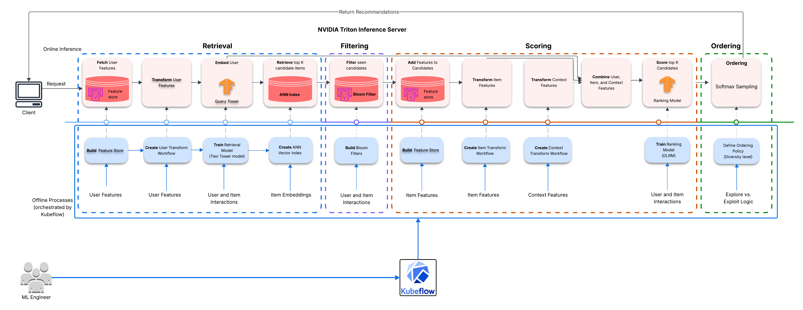
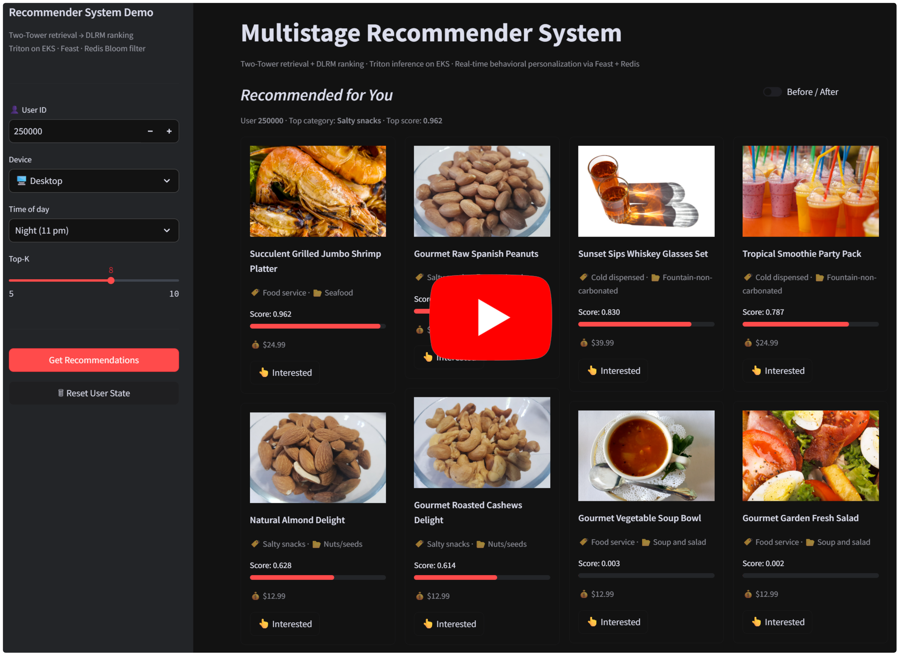
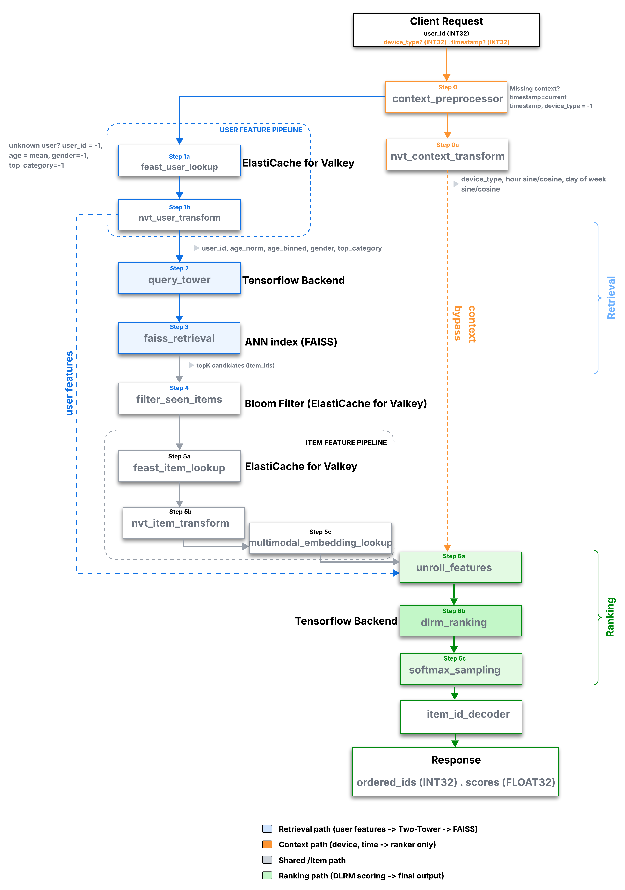

# Multistage Multimodal Recommender System on Amazon EKS

A production-grade multistage recommender system deployed on Kubernetes, combining two-tower retrieval, DLRM ranking, multimodal item embeddings, and a real-time behavioral personalization loop.  

**Model serving pipeline**

---

## Architecture

**MLOps architecture**

---

## Medium article

[Deploying a Four-stage Recommender System on Kubernetes featuring Multimodal Embeddings, Cold Start handling, Bloom Filters, and Feature Caching](https://mustaphaunubi.medium.com/building-a-production-multistage-recommender-system-on-kubernetes-featuring-multimodal-embeddings-5bcd6d7bbf56?postPublishedType=repub)

---
## Video Demo
Click to watch the Demo

## How it works

A user request triggers a 14-stage ensemble served by NVIDIA Triton Inference Server on EKS:

1. **Feast user lookup** — fetches user features (age, gender, `top_category`) from a Redis online store
2. **NVT transforms** — applies the same NVTabular preprocessing workflow used during training to user, item, and context features
3. **Two-Tower retrieval** — encodes the user query and searches a FAISS index of item embeddings to retrieve the top-N candidates
4. **Bloom filter** — removes items the user has already seen using a Redis/Valkey Bloom filter
5. **Feast item lookup** — resolves item features (category, price, gender) from a numpy in-memory cache loaded at startup (~0.5ms vs ~195ms for a live Feast round trip)
6. **Multimodal embedding lookup** — attaches CLIP image and sentence-transformer text embeddings (PCA-reduced to 64-dim each) to each candidate
7. **DLRM ranking** — scores the filtered candidates; a reranker reranks and samples from the scored candidates and  results are returned to the caller enriched with DynamoDB item metadata

---

## Real-time behavioral personalization

`top_category` — the user's dominant item category over the past 24 hours — is updated in near real-time without retraining:

- When a user interacts with an item, the serving Lambda adds it to a Redis sorted set (`user:{id}:recent_items`) and enqueues an SQS message
- The `recsys-feature-computation` Lambda triggers on that message, recomputes `top_category` from the sorted set, and writes it to both the **Feast online store** (Redis) for immediate serving and the **S3 offline store** (Parquet) for the next incremental training run
- The incremental training pipeline reads the S3 offline store to override stale Feast historical features, eliminating training/serving skew for `top_category`

---

## Stack

| Layer | Technology |
|---|---|
| Model serving | NVIDIA Triton Inference Server |
| Orchestration | Amazon EKS, Karpenter, Kubernetes HPA |
| Feature store | Feast (Redis online store, S3 offline store) |
| Behavioral cache | Amazon ElastiCache (Redis/Valkey) |
| Item metadata | Amazon DynamoDB |
| Serving Lambda | AWS Lambda + Function URL |
| Real-time features | AWS SQS → Lambda → Feast + S3 |
| Training pipeline | Kubeflow Pipelines on EKS |
| Preprocessing and Training | NVIDIA NVTabular, Merlin-Tensorflow |

---

## Deployment

Full deployment instructions: [Docs/documentation.md](Docs/documentation.md)
